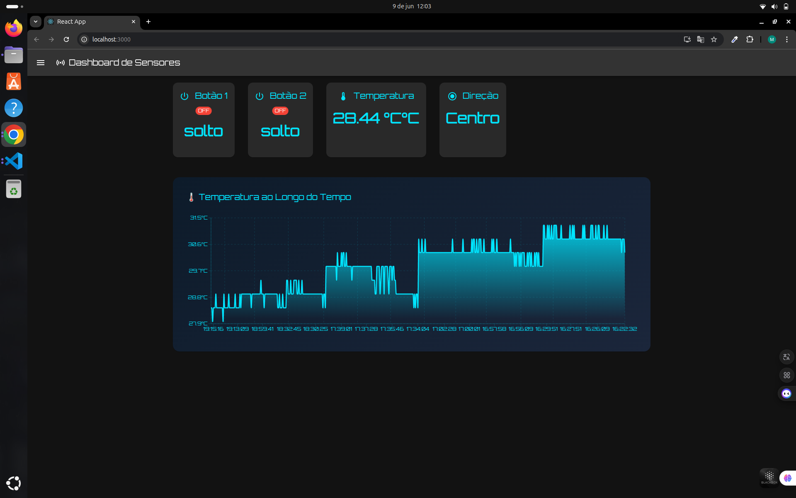

Claro! Abaixo está o conteúdo completo do `README.md` em **Markdown**, pronto para copiar e colar no seu projeto:

```markdown
# Dashboard de Sensores - React

Este projeto é uma aplicação em **React** que exibe em tempo real os dados recebidos de sensores, incluindo o estado de dois botões, a leitura da temperatura e a direção de um joystick. Os dados são atualizados automaticamente a cada 5 segundos a partir de uma API backend.

## 📸 Imagem da Interface

> Coloque a imagem `dashboard-preview.png` na pasta `public/` da aplicação.



---

## 🚀 Funcionalidades

- Visualização em tempo real dos dados:
  - Estado do **Botão 1** e **Botão 2** (com indicação visual ON/OFF)
  - Temperatura ambiente atual
  - Direção do joystick (ex: cima, baixo, esquerda, direita)
- 📊 **Gráfico histórico da temperatura** para análise visual
- Atualização automática a cada 5 segundos
- Interface moderna com Material UI

---

## 🛠️ Tecnologias Utilizadas

- [React](https://reactjs.org/)
- [Material UI (MUI)](https://mui.com/)
- [Axios](https://axios-http.com/)
- [Recharts](https://recharts.org/) – para visualização gráfica da temperatura
- [Node.js (backend externo)](https://nodejs.org/) – fornece os dados via API REST

---

## 📁 Estrutura do Projeto

```

📦 src/
┣ 📜 App.jsx               # Componente principal com layout e chamadas à API
┣ 📜 TemperatureChart.jsx # Componente de gráfico da temperatura
┣ 📜 theme.js              # Customização do tema Material UI
┣ 📦 assets/               # Imagens e recursos visuais
📜 public/
┣ 📷 dashboard-preview\.png # Imagem de visualização do dashboard
📜 README.md
📜 package.json

````

---

## ▶️ Como Rodar o Projeto

### 1. Clone o repositório

```bash
git clone https://github.com/SeuUsuario/SeuRepositorio.git
cd SeuRepositorio
````

### 2. Instale as dependências

```bash
npm install
```

### 3. Configure a URL da API

Certifique-se de que o backend esteja rodando em `http://localhost:5000/api/sensores`.
Caso esteja em outro IP (como um Raspberry Pi), altere a URL dentro do arquivo `App.jsx`:

```js
const { data } = await axios.get('http://<SEU_IP>:5000/api/sensores');
```

### 4. Inicie o projeto

```bash
npm start
```

A aplicação será iniciada em `http://localhost:3000`.

---

## 🤝 Contribuição

Sinta-se à vontade para abrir issues, enviar pull requests ou sugerir melhorias!

---

```

Se você quiser, posso também criar o `TemperatureChart.jsx` ou ajustar algo na estrutura. Deseja ajuda com isso também?
```
