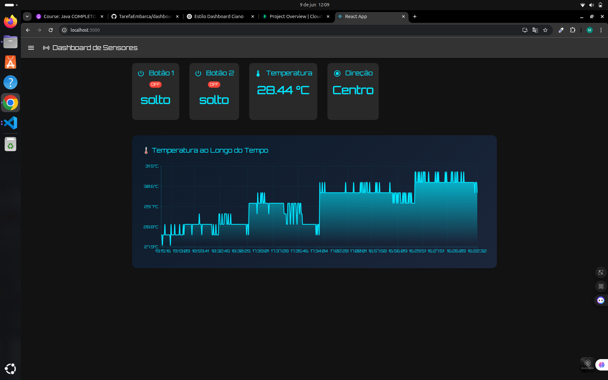

# Dashboard de Sensores - React

Este projeto é uma aplicação React que exibe em tempo real os dados recebidos de sensores, incluindo dois botões, leitura de temperatura e direção de um joystick. Os dados são atualizados a cada 5 segundos a partir de uma API backend.

## 📸 Imagem da Interface

## 🚀 Funcionalidades

- Visualização em tempo real de:
  - Estado do **Botão 1** e **Botão 2**
  - Temperatura atual
  - Direção do joystick
- Gráfico histórico da temperatura
- Atualização automática a cada 5 segundos
- Interface moderna com Material UI

## 🛠️ Tecnologias Utilizadas

- [React](https://reactjs.org/)
- [Material UI](https://mui.com/)
- [Axios](https://axios-http.com/)
- [Chart.js ou Recharts](https://recharts.org/) (dependendo do que está usado no `TemperatureChart`)

## 📁 Estrutura do Projeto

